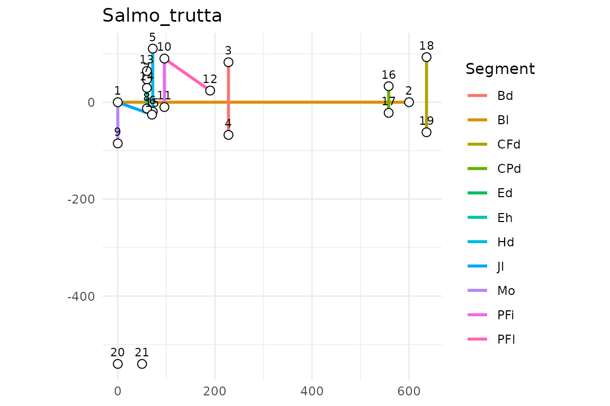
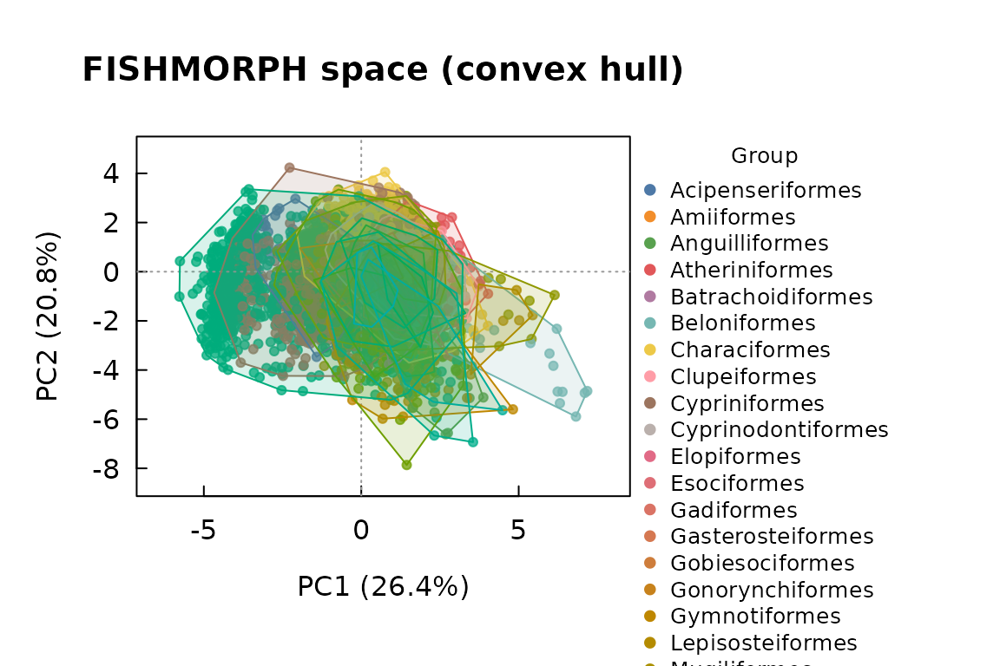
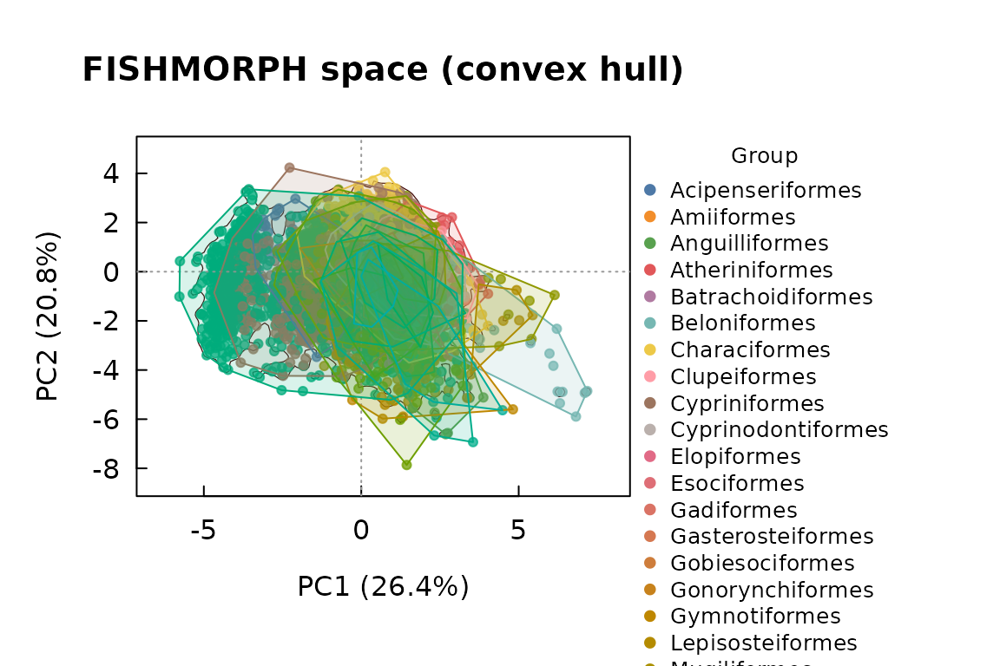

# Getting started with Rfishmorph

``` r

library(Rfishmorph)
```

## The FISHMORPH scheme

`Rfishmorph` implements the FISHMORPH morphospace of Brosse et
al. (2021): 21 landmarks digitized on a lateral photograph, from which
11 body segments and 9 dimensionless ratios are derived.

``` r

sc <- fishmorph_schema()
sc$segments
#>  [1] "Bl"  "Bd"  "Hd"  "Eh"  "Mo"  "PFi" "PFl" "Ed"  "Jl"  "CPd" "CFd"
sc$ratios
#> [1] "BEl" "VEp" "REs" "OGp" "RMl" "BLs" "PFv" "PFs" "CPt"
data.frame(ratio = sc$ratios,
           definition = vapply(sc$ratio_def, paste, "", collapse = " / "),
           `function` = sc$ratio_function[sc$ratios],
           check.names = FALSE)
#>     ratio definition                                      function
#> BEl   BEl    Bl / Bd  Hydrodynamism / position in the water column
#> VEp   VEp    Eh / Bd                     Vertical position of prey
#> REs   REs    Ed / Hd                                 Visual acuity
#> OGp   OGp    Mo / Bd          Feeding position in the water column
#> RMl   RMl    Jl / Hd                          Size of prey / mouth
#> BLs   BLs    Hd / Bd                  Position in the water column
#> PFv   PFv   PFi / Bd              Pectoral use for manoeuvrability
#> PFs   PFs   PFl / Bl Pectoral use for propulsion / manoeuvrability
#> CPt   CPt  CFd / CPd                  Caudal propulsion efficiency
```

## From landmarks to traits

``` r

lm <- read_landmarks_csv(
  system.file("extdata", "example_landmarks.csv", package = "Rfishmorph"))
lm
#> <fishmorph_landmarks>
#>   specimens : 2
#>   landmarks : 25 (2D)
#>   names     : Salmo_trutta, Cyprinus_carpio

seg <- fishmorph_segments(lm, scale_cm = 1)
seg
#>          specimen Bl  Bd  Hd  Eh  Mo PFi      PFl  Ed       Jl CPd CFd
#> 1    Salmo_trutta 12 3.0 2.6 1.2 1.7 2.0 2.300000 0.7 1.499999 1.1 3.1
#> 2 Cyprinus_carpio 15 5.2 3.4 1.6 2.1 2.6 2.899999 0.8 1.400000 1.6 4.0

fishmorph_ratios(seg)
#>          specimen      BEl       VEp       REs       OGp       RMl       BLs
#> 1    Salmo_trutta 4.000000 0.4000000 0.2692308 0.5666667 0.5769227 0.8666667
#> 2 Cyprinus_carpio 2.884615 0.3076923 0.2352941 0.4038462 0.4117648 0.6538462
#>         PFv       PFs      CPt
#> 1 0.6666667 0.1916667 2.818182
#> 2 0.5000000 0.1933333 2.500000
```

``` r

plot_landmarks(lm, specimen = 1)
```



## Reconstruction and the round-trip guarantee

[`reconstruct_fishmorph_landmarks()`](https://funtraits.github.io/Rfishmorph/reference/reconstruct_fishmorph_landmarks.md)
inverts
[`fishmorph_segments()`](https://funtraits.github.io/Rfishmorph/reference/fishmorph_segments.md).
The free parameters move landmarks around but never change segment
lengths, so the round-trip is exact.

``` r

seg1 <- list(Bl = 10, Bd = 3.2, Hd = 2.4, Eh = 1.1, Mo = 1.6, PFi = 1.9,
             PFl = 2.1, Ed = 0.6, Jl = 1.3, CPd = 1.0, CFd = 3.0)
check_reconstruction_roundtrip(seg1)
#> Round-trip: max error = 2.22e-16 cm (OK)
```

## The functional trait space

The ordination is fitted once on the reference database and then frozen,
so new specimens are *projected* into the same coordinate system rather
than re-estimating the axes.

``` r

ref <- load_fishmorph_reference()
#> FISHMORPH reference: segment (published) -- 8970 species.
ts  <- fishmorph_trait_space(ref, groups = ref$Order)
ts
#> <fishmorph_trait_space>
#>   specimens : 8970
#>   traits    : BEl, VEp, REs, OGp, RMl, BLs, PFv, PFs, CPt
#>   transform : no log10, scaled
#>   variance  : PC1 26.4%, PC2 20.8% (cum 47.2%)
#>   na_action : omit
```

``` r

plot_trait_space(ts, style = "hull")                 # per-group convex hulls
```



``` r

plot_trait_space(ts, style = "hull", reference_density = TRUE)  # + global density
```



## Quality control: segments vs landmarks

Two scale-invariant quantities let you check a workbook’s internal
consistency: the 9 ratios and the segments expressed as a fraction of
`Bl`.

``` r

segtab <- data.frame(
  Genus.species = paste0("sp", 1:6), Bl = 10,
  Bd = c(3, 3.2, 3.4, 3.6, 3.8, 4), Hd = c(2, 2.1, 2.2, 2.3, 2.4, 2.5),
  Eh = 1, Mo = 1.5, PFi = 2, PFl = 2.5, Ed = 0.5, Jl = 1.2, CPd = 1, CFd = 3)
cmp <- compare_segments_landmarks(segtab, segtab, id_col = "Genus.species")
summary(cmp)
#> <fishmorph_comparison>
#>   variant: standard | matched id column: Genus.species
#> 
#> Ratio agreement (landmark vs published):
#>  trait n pearson bias rmse
#>    BEl 6       1    0    0
#>    VEp 6       1    0    0
#>    REs 6       1    0    0
#>    OGp 6       1    0    0
#>    RMl 6       1    0    0
#>    BLs 6       1    0    0
#>    PFv 6       1    0    0
#>    PFs 6      NA    0    0
#>    CPt 6      NA    0    0
#> 
#>   weakest ratio: BEl (r = 1.00)
```

## Adding a new species

``` r

rec <- new_fishmorph_species(
  "Genus novus",
  segments = list(Bl = 10, Bd = 3.2, Hd = 2.4, Eh = 1.1, Mo = 1.6, PFi = 1.9,
                  PFl = 2.1, Ed = 0.6, Jl = 1.3, CPd = 1.0, CFd = 3.0),
  family = "Cyprinidae", order = "Cypriniformes")
ref2 <- add_fishmorph_species(ref, rec)
#> Added 1 species: Genus novus
nrow(ref2)
#> [1] 8971
```

Name resolution and the global freshwater list require `rfishbase` and
network access:

``` r

validate_species_names(c("Salmo trutta", "Esox_lucius"))
fw <- freshwater_fish_list()
```

## Reference

Brosse et al. (2021) *Global Ecology and Biogeography* 30:2330–2336.
<https://doi.org/10.1111/geb.13395>
